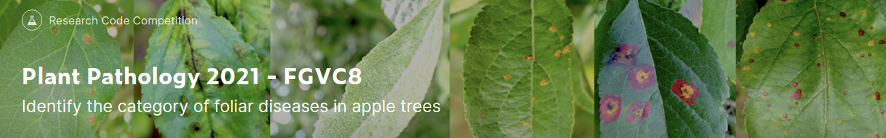
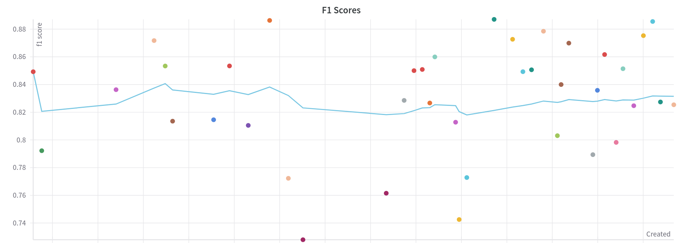

[![](https://img.shields.io/badge/Image%20Augmentations-Albumentations-F34423?style=for-the-badge&logo=data:image/png;base64,iVBORw0KGgoAAAANSUhEUgAAAFMAAABSCAYAAAAo7uilAAAIrklEQVR4Xu1cC0yVZRh+fxABQQnlcrwjnmIaq4M7iUXWaV6GQWqzNtaWukXIiJXNzdvs5LQlNNmwXJFaMK3T1lrhZunMjKZZXpaI6LRQSWGCeMF5AV2et+8jTolwzvf97/efi+v/t386/vd5L8//ft/3fpf/AJiXyYDJgMmAyYDJgMmAyYDJgMmAyYDJgMlACDKAK1aUIgD2eTsch325jGfODMLU1BaveG96PX+fO/cbESX9RAKh8hxra23gcCz24U+cT19bW0fDzZvJ5HjCwoRchZGVBxpYXPw1tLf7snrHp0tNTalw/Trd6/nzS0Xg+4JM/PzzAti7d4wgmHABmWOoZLKugV/d/3i3Ikxd0dvw93NsaUmE3NwSCTu+yQSIltDRt4jVCmCxtIjwoZ+Ze/c+C4cOxYsCYc81nzI7drwsoaNPES0+vgNiYm6I8CGdmdjYmArTp1eJgpB83l9SrrfYmDH1kJR0QYQP7cxcutQFv/8uisHz3Gdm4o4dY2UV9ZIbMKBVi4x0i/AhSyb++uvTsHNnpiiAu577jMV3HyCwkpm5XcaPkCUTystLBaXQvfF55QurqvJlyPAqM3ToaRl8SPaZePLkOExLy9SZTd6bYWNjhgwZXmVstgMy+JAjE8+fT4CZM/foJBLg8uU41i9OYUHz4p2XSfzmLS8C1q+fJkOGNxktJeWyCj5oWFy1aj1p/hwWhhgV1fcdHt73fF40H+fPly4tlyUjpDITT516CGbPfk3W+R5ybtbKOztJUJ+gqKj7NCtLS9/DiAh6Fslkml6ZxsbBxr8hP2vEtrZElltkIlWwXrsV1j3oCTt0SqOCghrdg44n0lGj7sDzzx/UE7iUbHq6cAoppSeQQuhyFeGAAeSsxA8/fBV/+GEiaeDy1Rqys6WnX5yvoGcm3rrVHzZvXsIWbmnvLyPjPMyaVQnh4caPPhMmfK/HqaCTCQcPToaamlF6nP5XNpyVknPmfKINH/5Xd11JUuMVlJTUYKxCP2rDK1filQaOkSM78Ny5gdxFrKnJMLSZx8Uhbt2aoyf84GZmScn75EGHR1lZOU0bOfJad8BKqnqRFs3WkpOTm/SQGTRZrKt7jO0W0gednJweu5EsM+2GZuYjj9zSS07wZkDr1r0Lp6UWY3rFhLGxoC1Y8BZ8++1/zyyWZpg//zv2hwh2d7D7FlRVvaiXEI88hoXdH2URHj9uw5gYcla6J036A69fFzZrlUx1O53l1BcRMBwjIQZzcs6QA+Uv4eRJ4eiPe/aoNfuKigUBI4VqCDdtWuyOjCRnJS5Z8oGMbayoKCK/MF7I19U9KGMnaDLY3h6PDscVcpAjRrjZ1u8gmQBw2bKPyHYk9shlfPCrDDqdH5MD5OuVxcVfyDqINlsr2VZ29nFZO0GRYwenHsRBg+jNm/eVR46kyTrPyLxIJrOw0CVrJ+ByePt2OL7+ejU5ON6HVVa+Ius429m0o8VCf3EuF7mkkvWRLIc//zzdnZhID27ChHN6jDMyJymRWVubqsdeQGUxL6+WmpVdc/fq6ll6HMby8mXkOT/P6IaGRD32PLJ+nwHhrl0zYerURynOcYw2efIfkJm5Wyc+WljRe1NosbRDbCxp9uNXMlkZMwzs9q06iegpvnz5G9rQoZ7FDDlVzc3SA1UvhVbrOc1iIS2u+nfV6KuvCqFFeBLPO0HPPXdQmzFD6miKRwl2dobB0aP0QwexsZfk3lgApfDCBYt7/Hg3ta/EwYMRDx3S3T3gjRsRaLe3ke2WlS0PIE1ypnDhQhc5ID7o/LMCpPtis6z+Snarq3N1G/UnAA8fVtvc4ptr+/fbKT6yRRCrEpnHjo2m2PULBq9ejcWpU08pBVRU9CnVOVyzZpWKbapdv+DY4ak5OHAgvUCPj9e18X9vEOxsEH3+n5t7RIUU40ujjRtXwjV9lUyPAJKSOnHevM+6/8aPTvOVc1518NKRHxvkNyf87iOECFbrAa24eC3bP59BrjHt9u2wbZsKn8ZhsaTkHZUmpoR1OP7kkSjpqKl53Dg2FDRhc/MwpeatcM6oi0CHowHPnuV9BLmLUQi/C2pc0V5SUgY3SLMw1Rg8+H7w229ZZGUZGQp90z9WDekz2cJAGmRl5QE/Ixm8qx87YjOEbD45uY2M7QYak5llZauhtVXVF1V8JOzbp2t1qYfBceP2qTqgnJlul+sVeOmlUFhMHcK+jXyITMjo0bVkbDdQiUxWoEfilCky3zWq+inE4+nTGly69DClLEJ2FEZLTGwWGhEIKJEJv/ySrdXXJ6g6YQj+7FmyGi0uDmDs2BNkBapAdpggCq3WayqlSMhg09IQW1tjVDmhD0BlZU5oaIhVdSAk8NHRV7Xk5ODUdawUSmWHp8jFcchkpKfAz8//2oiXSuoz8e23P+C/KkDp7LucZjuVsHEj/2qMF6ZcDZ9r85v/33N7Ws3dZu5+zjV5cAD19U/AihVOEil2+3ewaRMJqgTCpiaL0mECng1r1y5UcqIPMDuf+SQ543/8caLR/gj1YUcH3xL4k+w0JzI9vY1980NqEb4cZGQ+Q/VLGLikgL4BaMuWAvYTD8LjfF5t86PNRUVOVtPxA/1GX75/Pcabtays80Y7ItTHtm0fYOd3LlHffhcuJeWq0BBRgGXm0yTfCgsNGXy42/KZ6XLlw4kT5O8Iu5bPN2yYTeTKf7C0tJ/8p9yLZkxIUCuF8vJIu42ygbLMfIqUmbW19N/uuMc5qczEN98sh4sXZePqLTdiBMCiRb5+eoyuWwXJp5GRkaTTGySzuG3btK6P4hVWsNke+Jck4zpALDOzdPtos11jY0GUDjNqovjCC7t0O3kv8fX1KWpeiNGMzEm6/czOPiXWLC/hs5mzo3wzYfdu/rsX9GvlytVaenojXYEfkfzboUBd7mHD1Jq3zRYwEllmZurOTKdzbaC4NO2YDJgMmAyYDJgMmAyYDPzPGPgb9geHy8dhvq8AAAAASUVORK5CYII=)](https://albumentations.ai/ "Albumentations")

## Index
* [Problem Statement](#problemstatement)
* [Dataset](#dataset)
* [Model Architecture using Transfer Learning](#approach)
* [Random Search Hyperparameter Tuning](#tuning)
* [The Problem of Vanishing Gradients](#problems)
* [Further work](#future)
* [References](#references)

## Problem Statement 

Apples are one of the most important temperate fruit crops in the world. Foliar (leaf) diseases pose a major threat to the overall productivity and quality of apple orchards. The current process for disease diagnosis in apple orchards is based on manual scouting by humans, which is time-consuming and expensive.

Although computer vision-based models have shown promise for plant disease identification, there are some limitations that need to be addressed. Large variations in visual symptoms of a single disease across different apple cultivars, or new varieties that originated under cultivation, are major challenges for computer vision-based disease identification. These variations arise from differences in natural and image capturing environments, for example, leaf color and leaf morphology, the age of infected tissues, non-uniform image background, and different light illumination during imaging etc.

## Dataset 

The Plant Pathology 2021-FGVC8 Dataset [[1]](#1) contains approximately 23,000 high-quality RGB images of apple foliar diseases, including a large expert-annotated disease dataset. This dataset reflects real field scenarios by representing non-homogeneous backgrounds of leaf images taken at different maturity stages and at different times of day under different focal camera settings.

But for faster image loading and processing, we use the 256x256 resized version of the original rgb images, thanks to <a href="https://www.kaggle.com/ankursingh12/resized-plant2021/version/1">this</a> dataset.

## Model Architecture using Transfer Learning 
Convolutional neural networks (CNNs) are the most dominant machine learning approach for Visual Object Recognition. In practice, Visual Recognition systems have gained widespread attention after the release of the publicly available imagenet dataset [[2]](#2) containing 14 million images and 22 thousand visual categories. 
Starting from 2010, the ILSVR Challenges [[3]](#3) have led to the research of new CNN architectures [[6] ](#6)[[7] ](#7)[[8] ](#8)[[9]](#9), which achieve high accuracies on most of the image recognition problems, being trained on the robust imagenet dataset. These models and their weights are publicely available, which led to the idea of Transfer Learning, as discussed <a href="https://cs231n.github.io/transfer-learning/">here</a>. There are two major types of transfer learning: Fixed Feature Extractor and Fine-Tuning.

We have Fine-Tuned all the conv-layers of our base model and the fc layers which predict the output based on the number of classes. In our case, we are solving a multilabel multiclass classification problem, wherein we may have multiple diseases for each plant image. We apply the Sigmoid activation function on the raw output logits. 

In general, we use Sigmoid activation function for multilabel multiclass classification problem. The predicted labels are determined by a threshold value, which is a hyperparameter we can tune. More details about Sigmoid <a href="https://glassboxmedicine.com/2019/05/26/classification-sigmoid-vs-softmax/">here</a>.

## Random Search Hyperparameter Tuning 

For our research, Random Search [[4]](#4) was used for sweeping hyperparameters to find the most optimum set. Random Search has proven to yield better results as compared to Grid Search Algorithm. More details about why we choose Randomized Search <a href="https://analyticsindiamag.com/why-is-random-search-better-than-grid-search-for-machine-learning/">here</a>.

Also, another way is to first run Randomized Search to narrow down the set of hyperparameters to tune, and then apply Grid Search to extensively search for the most valuable hyperparameter set.

The hyperparameters we are tuning are:
* Base Model
* Learning Rate
* Optimizer
* Batch Size
* Epochs
* Loss Function

The metric for measuring the accuracy of predictions for the model was F1-Score [[5]](#5), which is calculated using Precision and Recall. More details on accuracy metrics for multilabel classification <a href="https://medium.com/synthesio-engineering/precision-accuracy-and-f1-score-for-multi-label-classification-34ac6bdfb404">here</a>.

There were 40 Runs for 18 hours in the WandB Sweep, to produce the following results:

 

 
| Sr. | Train F1 | Val F1 | Architecture | Loss Fun | Optimizer | LR     | Batch Size | Epochs |
|-----|----------|--------|--------------|----------|-----------|--------|------------|--------|
| 1   | 0.9433   | 0.8753 | densenet     | BCE      | Adam      | 1e-4   | 32         | 6      |
| **2**   | **0.9392**   | **0.8871** | **densenet**     | **BCE**      | **Adam**      | **1e-4**   | **16**         | **7**     |
| 3   | 0.9292   | 0.8855 | densenet     | BCE      | Adam      | 1e-4   | 32         | 5      |
| 4   | 0.9171   | 0.8727 | densenet     | BCE      | Adam      | 1e-4   | 16         | 5      |
| 5   | 0.8924   | 0.8785 | resnet       | BCE      | Adam      | 1e-4   | 8          | 7      |
| 6   | 0.8868   | 0.8600 | vggnet       | BCE      | SGD       | 3e-4   | 8          | 8      |

On analysing the results we find that:
* Top 4 Train F1 Scores was obtained on the DenseNet Architecture [[9]](#9).
* The Densenet model having the highest Train F1 score of 0.9433 did overfit on the 6th epoch, reducing its Validation F1 Score from 0.8855 to 0.8753.  
* Binary Cross Entropy is a better loss function for this problem as compared to the Multi Label Soft Margin Classifier.
* Adam Optimizer [[10]](#10) is more efficient than the SGD Optimizer.
* 1e-4 is the optimum converging learning rate relative to the number of epochs our models are tested.

 

 

We are comparing two different loss functions, the Binary Cross Entropy and the Multi Label Soft Margin Loss. The loss values for MLSML is relatively greater (for a particular f1 score) as compared to the BCE loss, as observed above.
 

A plot of Validation F1 Scores, tracing the Average values across all 40 runs of the sweep.

## The Problem of Vanishing Gradients 
As stated in the ResNet paper [[8]](#8), the problem of Vanishing/Exploding gradients is a notorious problem, hampering convergence. To overcome this problem to some extent, we have used the values for normalized initialization of the imagenet dataset [[2]](#2), referenced [[11]](#11).

But still, while adding the bottleneck dense layers on top of our transfer learning base models, we witness the Vanishing Gradient Problem. 
We have submitted models for different fully connected layer combinations for DenseNet [[9]](#9) and ResNet [[8]](#8), to get a substantive observation of the Vanishing Gradient Problem.

| Architecture                | Accuracy |   
|-----------------------------|----------|
| **densenet**                    |**0.77045**  |   
| densenet+16                 | 0.72179  |   
| densenet+64+16              | 0.74275  |  
| densenet+256+64+16          | 0.70655  |   
| densenet+512+256+64+16      | 0.69944  |   
| densenet+1024+512+256+64+16 | 0.67220  |  

| Architecture              | Accuracy |  
|---------------------------|----------|
| **resnet**                    |**0.76805**  |   
| resnet+16                 | 0.72908  | 
| resnet+64+16              | 0.72280  |  
| resnet+256+64+16          | 0.71283  |   
| resnet+512+256+64+16      | 0.70046  |   
| resnet+1024+512+256+64+16 | 0.65060  |  

Therefore, we have replaced the top layer of the imagenet pre-trained model with a linear layer, having the previous layer input size, predicting Sigmoid probablities for the 6 classes. For training the model, we fine tune all the layers of the model, i.e. the weights of all the layers backpropagate to update its values on the train dataset. The values of the 6 output neurons are compared with the threshold to determine the labels.

Our kaggle submission achieved:

## Further Work 
- [ ] Exploring the Focal Loss function [[12]](#12) to overcome Class Imbalance, using techniques like OHEM [[13]](#13).
- [ ] Hyperband Optimization [[14]](#14) for Hyperparameter Tuning Sweeps.

## References 
 [1] Ranjita Thapa, Qianqian Wang, Noah Snavely, Serge Belongie, Awais Khan. The Plant Pathology 2021 Challenge dataset to classify foliar disease of apples.

 [2] Deng, J., Dong, W., Socher, R., Li, L.-J., Li, K., & Fei-Fei, L. (2009). Imagenet: A large-scale hierarchical image database. _In 2009 IEEE conference on computer vision and pattern recognition (pp. 248–255)._

 [3] Olga Russakovsky, Jia Deng, Hao Su, Jonathan Krause, Sanjeev Satheesh, Sean Ma, Zhiheng Huang, Andrej Karpathy, Aditya Khosla, Michael Bernstein, Alexander C. Berg, Li Fei-Fei. ImageNet Large Scale Visual Recognition Challenge. _International Journal of Computer Vision volume 115, pages211–252 (2015)_.

 [4] James Bergstra, Yoshua Bengio. Random Search for Hyper-Parameter Optimization. _Journal of Machine Learning Research 13 (2012) 281-305._

 [5] Zachary C. Lipton, Charles Elkan, and Balakrishnan Naryanaswamy. Thresholding Classifiers to Maximize F1 Score. _Joint European Conference on Machine Learning and Knowledge Discovery in Databases (2014) 225-239._

 [6] Alex Krizhevsky, Ilya Sutskever, Geoffrey E. Hinton. ImageNet Classification with Deep Convolutional Neural Networks. 

 [7] Karen Simonyan, Andrew Zisserman. Very Deep Convolutional Networks for Large-Scale Image Recognition. _ICLR (2015)._ 

 [8] Kaiming He, Xiangyu Zhang, Shaoqing Ren, Jian Sun. Deep Residual Learning for Image Recognition. _Conference on Computer Vision and Pattern Recognition (CVPR) (2016)_.

 [9] Gao Huang, Zhuang Liu, Laurens Van Der Maaten, Kilian Q. Weinberger. Densely Connected Convolutional Networks. _Conference on Computer Vision and Pattern Recognition (CVPR) (2017)_.

 [10] Kingma, D.P., & Ba, J. (2015). Adam: A Method for Stochastic Optimization. _CoRR, abs/1412.6980._

 [11] Glorot, X., & Bengio, Y. (2010). Understanding the difficulty of training deep feedforward neural networks. _AISTATS_.

 [12] Lin, T., Goyal, P., Girshick, R.B., He, K., & Dollár, P. (2020). Focal Loss for Dense Object Detection. _IEEE Transactions on Pattern Analysis and Machine Intelligence, 42, 318-327._

 [13] Shrivastava, A., Gupta, A., & Girshick, R.B. (2016). Training Region-Based Object Detectors with Online Hard Example Mining. _IEEE Conference on Computer Vision and Pattern Recognition (CVPR), (2016) 761-769._

 [14] Li, L., Jamieson, K.G., DeSalvo, G., Rostamizadeh, A., & Talwalkar, A.S. (2017). Hyperband: A Novel Bandit-Based Approach to Hyperparameter Optimization._ J. Mach. Learn. Res., 18, 185:1-185:52._